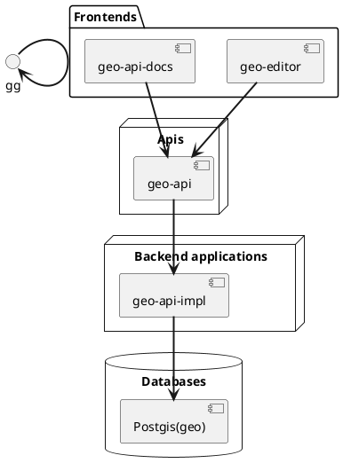

# Future Position X monorepo

## tl;dr

This repository includes those primary projects:

* Frontend [geo-editor](http://editor.dev.gia.fpx.se) [(src)](geo-editor/)
* Backend [geo-api](http://dev.gia.fpx.se/docs) [(src)](geo-api/)

### Architecture

